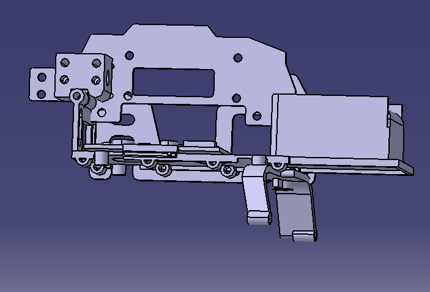
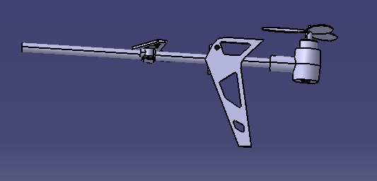
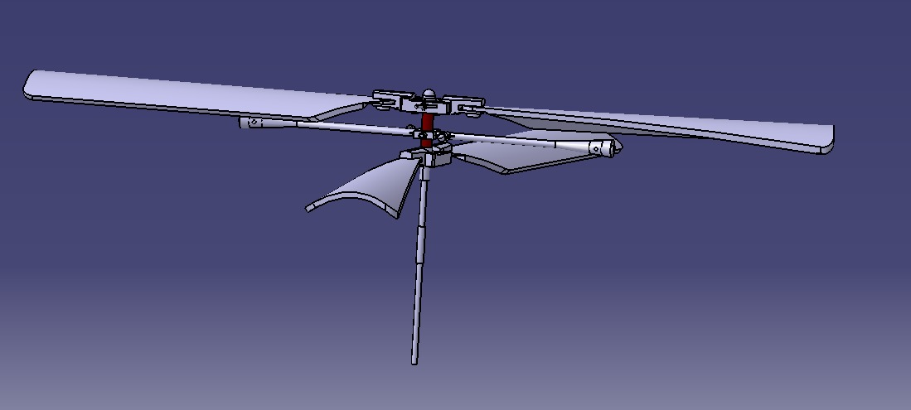
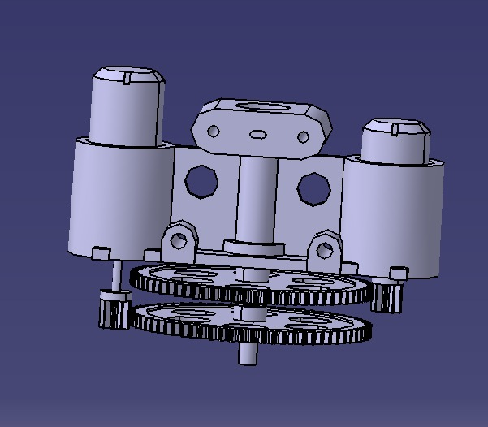

# Helicopter Toy Design in CATIA

This project showcases the design and assembly of a helicopter toy using CATIA. The project includes the complete 3D model of the helicopter, with each component meticulously designed and assembled. The parts are named in Romanian to reflect the detailed construction of the helicopter.

## Project Overview
This project involves the design of a helicopter toy, including the body, tail, rotors, and motor assembly. Each part has been modeled separately and then assembled to create a functional toy helicopter. The project demonstrates the use of CATIA's powerful 3D modeling capabilities.

## Components

This is the complete assembly of the helicopter toy. It includes all the individual components brought together.

### 2. Helicopter Body (Caroseria Elicopterului)

This part represents the main body of the helicopter, which houses the motor and other essential components.

### 3. Helicopter Tail (Coada Elicopterului)

The tail of the helicopter includes the rear rotor and helps in stabilizing the helicopter during flight.

### 4. Helicopter Blades (Elicea Elicopterului)

These are the main rotors of the helicopter, which provide the necessary lift for the helicopter to take off.

### 5. Helicopter Motor Assembly (Motorul Elicopterului)

The motor assembly drives the rotors and is essential for the helicopter's functionality.
